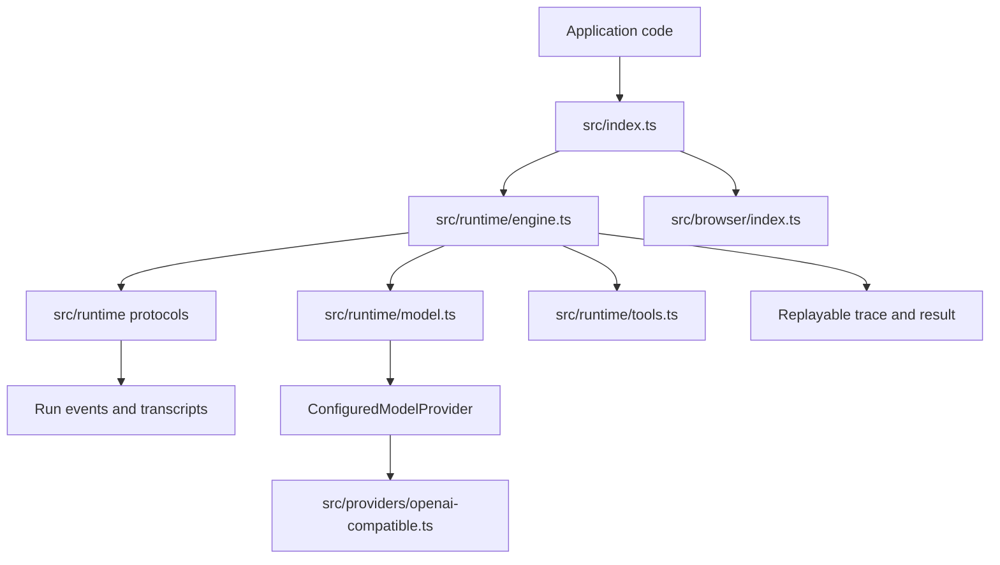

<!-- generated-by: gsd-doc-writer -->
# Architecture

## System Overview

Dogpile is a stateless TypeScript SDK that coordinates one caller-provided model
provider through first-party multi-agent protocols. The public entrypoint in
`src/index.ts` exports high-level run, stream, replay, provider, logging,
termination, tracing, runtime tool, and type contracts. Runtime execution lives
under `src/runtime/`, provider adapters live under `src/providers/`, browser
entrypoints live under `src/browser/`, and deterministic test helpers live under
`src/testing/`.

## Component Diagram



## Data Flow

1. A caller invokes the public API from `src/index.ts`, usually through
   `Dogpile`, `run`, `stream`, or `createEngine`.
2. `src/runtime/engine.ts` validates options, normalizes protocol and tier
   choices, orders agent roles, and selects the protocol implementation.
3. The selected protocol module records role-assignment events, builds model
   requests, invokes `generateModelTurn` in `src/runtime/model.ts`, and appends
   transcript entries.
4. Runtime tool requests, when present, flow through `src/runtime/tools.ts` and
   emit tool-call and tool-result events alongside model events.
5. Completion produces a `RunResult` with output, transcript, event log,
   accounting, health summary, metadata, and a serializable trace.
6. `replay` and `replayStream` rebuild result and stream shapes from the saved
   trace without calling the provider again.

## Key Abstractions

| Abstraction | Location | Purpose |
| --- | --- | --- |
| `Dogpile` | `src/runtime/engine.ts` | Branded high-level API exposing pile, stream, createEngine, replay, and replayStream helpers. |
| `Engine` | `src/types.ts` | Reusable low-level interface for repeated runs with fixed protocol, tier, model, agents, tools, and budgets. |
| `ConfiguredModelProvider` | `src/types.ts` | Caller-owned provider boundary with an id and generate method. |
| `Protocol` | `src/types.ts` | Public union for sequential, broadcast, shared, and coordinator coordination strategies. |
| `RunResult` | `src/types.ts` | Final result contract containing output, transcript, trace, usage, accounting, metadata, and health. |
| `Trace` | `src/types.ts` | Serializable replay artifact for events, provider calls, protocol decisions, and run inputs. |
| `RuntimeTool` | `src/types.ts` | Tool definition contract for model-visible tools and runtime execution. |
| `DogpileError` | `src/types.ts` | Stable discriminated error surface used by validation, providers, cancellation, and replay checks. |
| `createOpenAICompatibleProvider` | `src/providers/openai-compatible.ts` | Dependency-free adapter for OpenAI-compatible chat-completions endpoints. |
| `createDeterministicModelProvider` | `src/testing/deterministic-provider.ts` | Repository-only deterministic provider used by tests and examples. |

## Directory Structure Rationale

```text
src/
  index.ts        Public package-root exports.
  browser/        Browser-specific ESM entrypoint.
  providers/      Provider adapters that implement ConfiguredModelProvider.
  runtime/        Protocol execution, validation, events, tracing, tools, and replay.
  runtime/tools/  Built-in and Vercel AI tool adapter helpers.
  testing/        Deterministic providers for repository tests.
  tests/          Cross-cutting contract, packaging, browser, replay, and smoke tests.
  types/          Specialized exported type groups.
  benchmark/      Repository benchmark harness code.
```

The package keeps runtime code in focused modules so the public exports in
`src/index.ts` can expose stable SDK contracts while implementation-only helpers
remain outside the published package surface. `package.json` maps public subpath
exports to emitted `dist/` files and limits publishable files to runtime,
browser, provider, type, README, changelog, and license artifacts.
